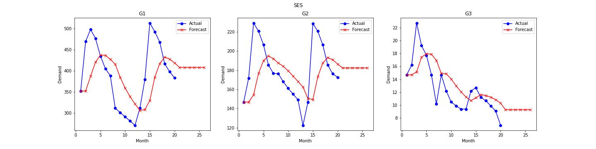
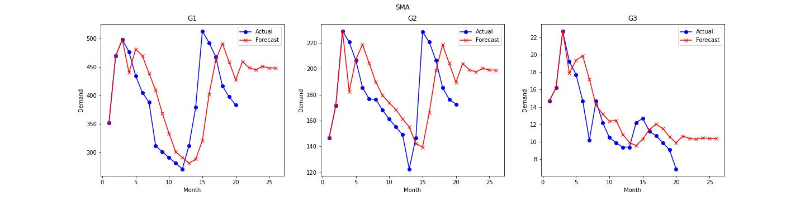
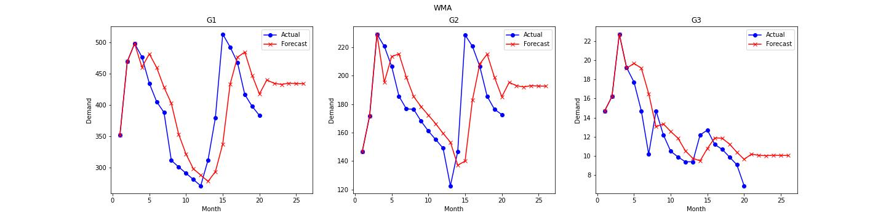
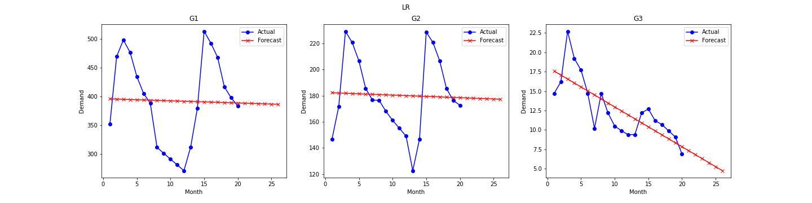
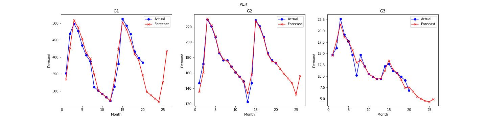

# Production Planning

This repository contains the files of my project for the "Production Planning"
course at Amirkabir University of Technology (Tehran Polytechnic) during the
Fall 2023 semester.

## Phase 1: Demand Forecasting

### Description

The dataset contains 6 tables, containing the actual demands for 6 type of
products belonging to 3 groups:

- Group 1 (G1): M1, M3, and M4
- Group 2 (G2): M2 and M5
- Group 3 (G3): M6

This phase focuses on 3 major contributions:

1. Predicting the demands for each group at the next 6 steps in the time series,
   implementing and using various forecasting methods such as Simple Exponential
   Smoothing (SES) and Linear Regression (LR).
2. Conducting error analysis on the resulting predictions from the forecasting
   methods, calculating MFE and MAE for each of them.
3. Calculating the tracking signal for each forecasting method.

### Details

Our demand forecasting section contains 5 methods:

1. Simple Exponential Smoothing (SES) with `alpha=0.3`.
2. Simple Moving Average (SMA) with `n=3`.
3. Weighted Moving Average (WMA) with `weights=[0.2, 0.3, 0.5]`.
4. Linear Regression (LR)
5. Adjusted Linear Regression (ALR) with `cycle_length=12`.

### Results



 


### Error Analysis and Tracking Signal

This section's results can be found at `./phase_1/output.xlsx`. However, we can
have a glimpse at the tracking signals:

<div>
<table border="1" class="dataframe">
  <thead>
    <tr style="text-align: right;">
      <th></th>
      <th>G1</th>
      <th>G2</th>
      <th>G3</th>
    </tr>
  </thead>
  <tbody>
    <tr>
      <th>SES</th>
      <td>1.627202</td>
      <td>1.494879</td>
      <td>-5.000000</td>
    </tr>
    <tr>
      <th>SMA</th>
      <td>-1.497890</td>
      <td>-0.543943</td>
      <td>-5.000000</td>
    </tr>
    <tr>
      <th>WMA</th>
      <td>-2.279876</td>
      <td>-1.372624</td>
      <td>-5.000000</td>
    </tr>
    <tr>
      <th>LR</th>
      <td>4.758926</td>
      <td>4.039556</td>
      <td>3.254925</td>
    </tr>
    <tr>
      <th>ALR</th>
      <td>5.000000</td>
      <td>3.809070</td>
      <td>1.948311</td>
    </tr>
  </tbody>
</table>
</div>

## Phase 2: S&OP

### Description

In this phase, we use the forecasts of the first phase in the S&OP of these 3
product groups, modeling an LP problem and conducting sensitivity analysis on
two of its parameters.

The objective function, constraints, parameters, and decision variables can be
found at `./phase_2/report.pdf`. Also, the implementation of this problem in
Python's PuLP can be found at `./phase_2/notebook.ipynb`. Moreover, the solved
model is exported and saved at `./phase_2/model.json`.

### Results

```
total cost: 64344855250000.0
```

<div>
<table border="1" class="dataframe">
  <thead>
    <tr style="text-align: right;">
      <th></th>
      <th>T20</th>
      <th>T21</th>
      <th>T22</th>
      <th>T23</th>
      <th>T24</th>
      <th>T25</th>
    </tr>
  </thead>
  <tbody>
    <tr>
      <th>RP</th>
      <td>(434092, 147035, 4909)</td>
      <td>(434092, 147035, 4909)</td>
      <td>(434092, 147035, 4909)</td>
      <td>(434148, 147035, 4848)</td>
      <td>(434148, 147035, 4848)</td>
      <td>(434148, 147035, 4848)</td>
    </tr>
    <tr>
      <th>OP</th>
      <td>(5788, 18840, 1719)</td>
      <td>(1, 11930, 0)</td>
      <td>(0, 0, 0)</td>
      <td>(0, 0, 0)</td>
      <td>(0, 0, 0)</td>
      <td>(0, 0, 0)</td>
    </tr>
    <tr>
      <th>PI</th>
      <td>(434092, 147035, 4909)</td>
      <td>(0, 0, 0)</td>
      <td>(0, 0, 0)</td>
      <td>(56, 0, 0)</td>
      <td>(0, 0, 0)</td>
      <td>(0, 0, 0)</td>
    </tr>
    <tr>
      <th>PD</th>
      <td>(0, 0, 0)</td>
      <td>(0, 0, 0)</td>
      <td>(0, 0, 0)</td>
      <td>(0, 0, 61)</td>
      <td>(0, 0, 0)</td>
      <td>(0, 0, 0)</td>
    </tr>
    <tr>
      <th>IL</th>
      <td>(0, 0, 0)</td>
      <td>(-599, 0, -606)</td>
      <td>(655, -6008, -703)</td>
      <td>(0, -6093, -408)</td>
      <td>(-44, 8983, 69)</td>
      <td>(0, 0, 0)</td>
    </tr>
    <tr>
      <th>IS</th>
      <td>(0, 0, 0)</td>
      <td>(0, 0, 0)</td>
      <td>(655, 0, 0)</td>
      <td>(0, 0, 0)</td>
      <td>(0, 8983, 69)</td>
      <td>(0, 0, 0)</td>
    </tr>
    <tr>
      <th>IG</th>
      <td>(0, 0, 0)</td>
      <td>(599, 0, 606)</td>
      <td>(0, 6008, 703)</td>
      <td>(0, 6093, 408)</td>
      <td>(44, 0, 0)</td>
      <td>(0, 0, 0)</td>
    </tr>
    <tr>
      <th>TW</th>
      <td>241112</td>
      <td>241112</td>
      <td>241112</td>
      <td>241110</td>
      <td>241110</td>
      <td>241110</td>
    </tr>
    <tr>
      <th>OW</th>
      <td>37940</td>
      <td>17181</td>
      <td>0</td>
      <td>0</td>
      <td>0</td>
      <td>0</td>
    </tr>
    <tr>
      <th>HW</th>
      <td>221112</td>
      <td>0</td>
      <td>0</td>
      <td>0</td>
      <td>0</td>
      <td>0</td>
    </tr>
    <tr>
      <th>FW</th>
      <td>0</td>
      <td>0</td>
      <td>0</td>
      <td>2</td>
      <td>0</td>
      <td>0</td>
    </tr>
  </tbody>
</table>
</div>

### Sensitivity Analysis

As said, sensitivity analysis is conducted on two following parameters:

#### Regular Salary

```
rs = 12000000,	total cost: 60004857250000.0
rs = 13000000,	total cost: 61451523250000.0
rs = 14000000,	total cost: 62898189250000.0
rs = 15000000,	total cost: 64344855250000.0
rs = 16000000,	total cost: 65791521250000.0
rs = 17000000,	total cost: 67238187250000.0
rs = 18000000,	total cost: 68684853250000.0
```

#### Hiring Cost

```
hc = 1200000,	total cost: 64079520850000.0
hc = 1600000,	total cost: 64167965650000.0
hc = 2000000,	total cost: 64256410450000.0
hc = 2400000,	total cost: 64344855250000.0
hc = 2800000,	total cost: 64433300050000.0
hc = 3200000,	total cost: 64521744850000.0
hc = 3600000,	total cost: 64610189650000.0
```
